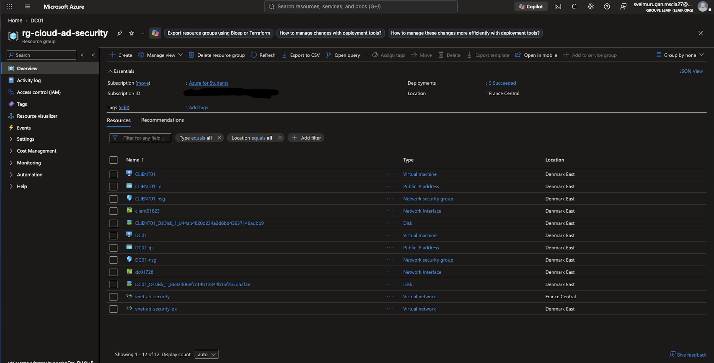
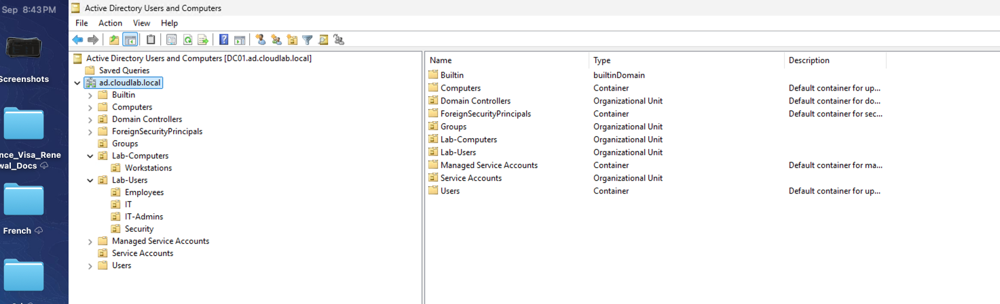
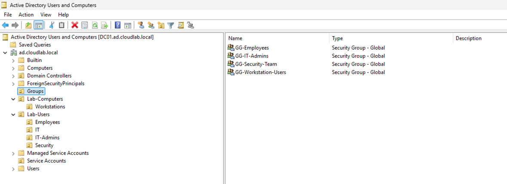
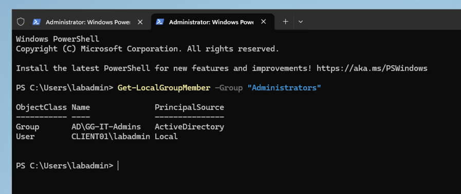
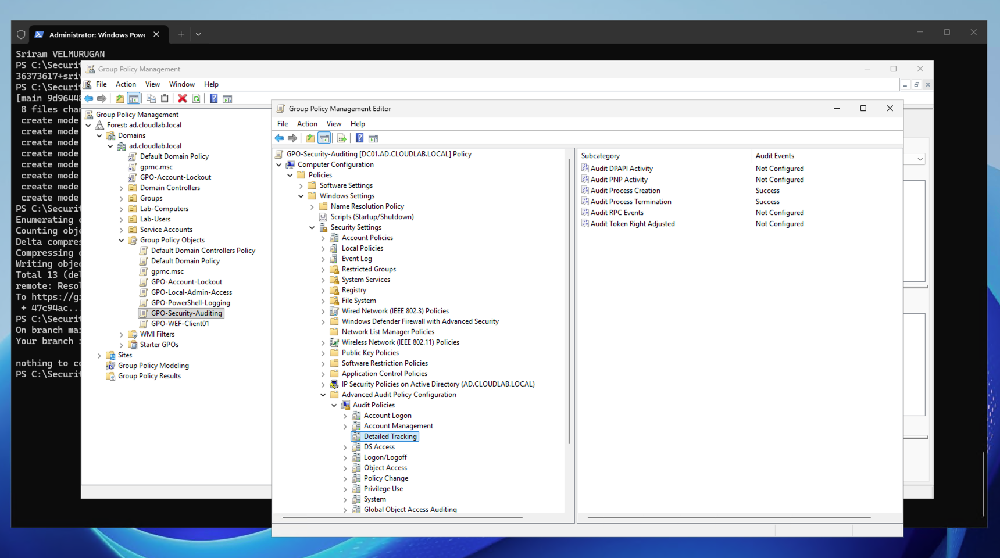
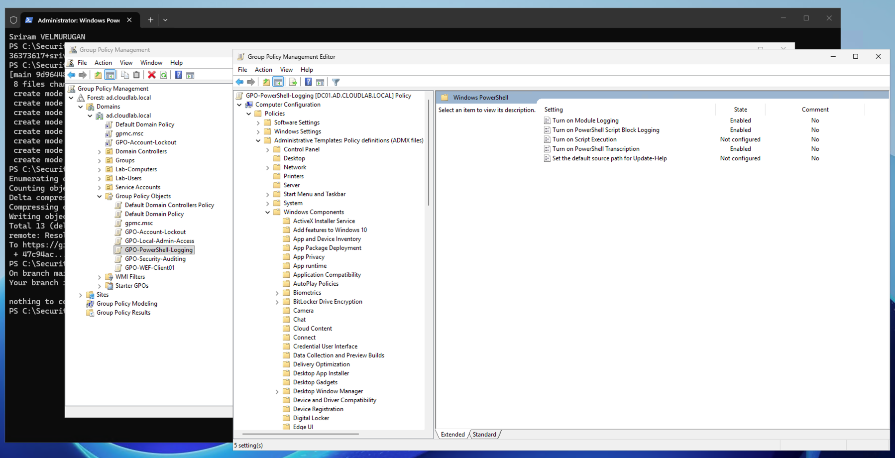
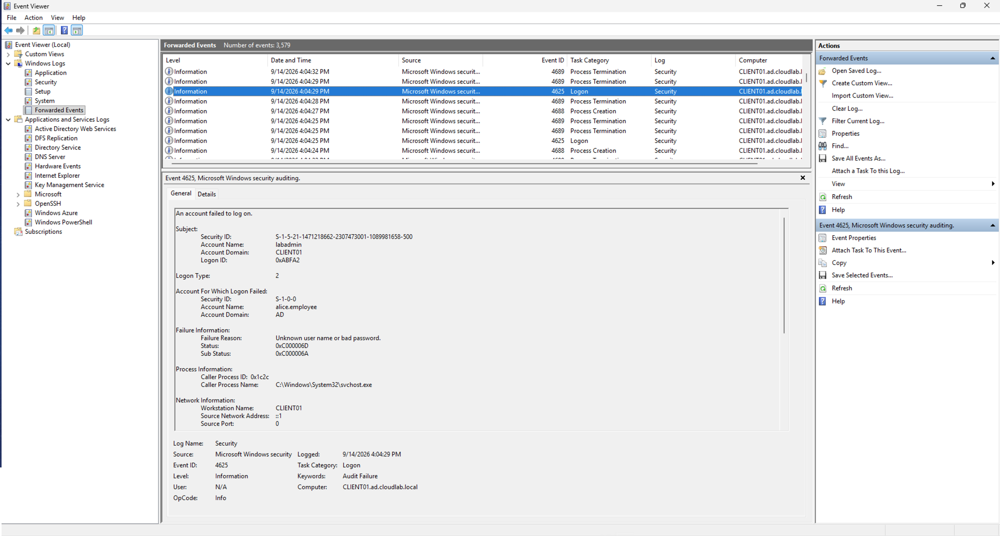
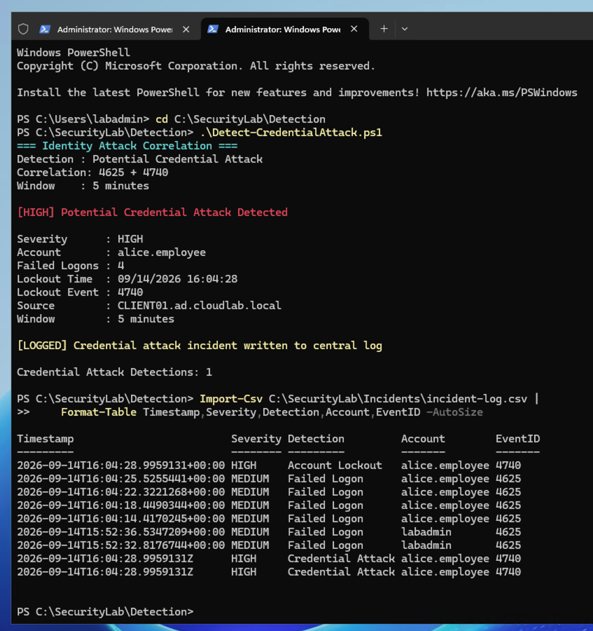
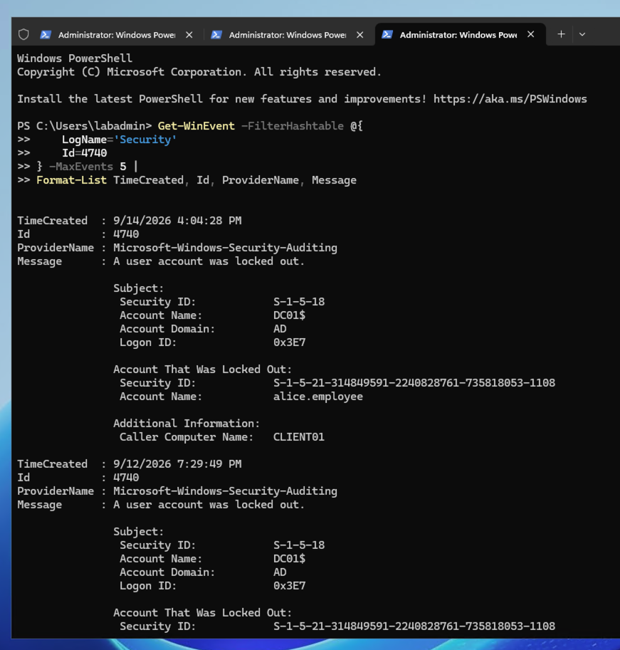
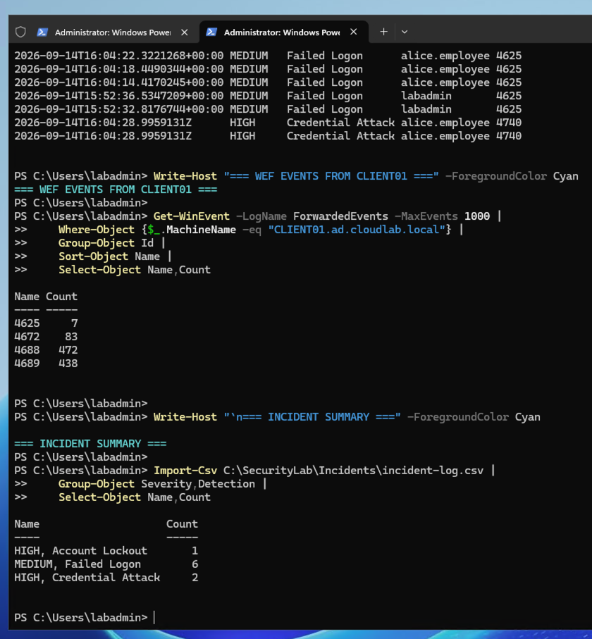

# Cloud AD Infrastructure & Identity Security Lab

Hands-on cybersecurity lab built in **Microsoft Azure** to simulate a small enterprise Windows environment and implement identity security, security monitoring, and detection engineering.

## 🎯 Key Skills Demonstrated

- Microsoft Azure infrastructure
- Active Directory & AD DS
- Identity & Access Management (IAM)
- RBAC / least-privilege access
- Windows Security Auditing
- Group Policy (GPO)
- PowerShell security logging
- Windows Event Forwarding (WEF)
- Security event monitoring
- Detection Engineering
- Event correlation
- Account lockout detection
- Failed authentication detection
- Basic incident triage
- Security automation with PowerShell

---

## 🏗️ Architecture

```text
                    Microsoft Azure
                          |
                  Azure Virtual Network
                          |
              +-----------+-----------+
              |                       |
            DC01                  CLIENT01
       Windows Server          Windows Server
       Active Directory        Domain Joined
       DNS + WEC               Security Logs
       Detection Engine             |
              |                     |
              +------ WEF ----------+
                          |
                   ForwardedEvents
                          |
                  PowerShell Detection
                          |
                   Incident Log (CSV)
```

**Domain:** `ad.cloudlab.local`

---

## 🔐 Security Implementation

### Identity & Access Management
- Active Directory domain and OU structure
- Security groups for role-based access
- Dedicated IT Administrator group
- Centralized local Administrator access through GPO
- Domain-joined Windows endpoint

### Security Monitoring
- Windows Advanced Audit Policy
- Failed logon detection — **4625**
- Account lockout detection — **4740**
- Privileged activity monitoring — **4672**
- Process creation / termination — **4688 / 4689**
- PowerShell Script Block Logging — **4104**
- PowerShell Module Logging and Transcription

### Centralized Event Collection

Windows Event Forwarding (WEF) is configured to collect security events from `CLIENT01` into the centralized `ForwardedEvents` log on `DC01`.

---

## 🛡️ Detection Engineering

Custom PowerShell detections were developed for:

| Detection | Event | Severity |
|---|---:|---|
| Failed Logon | 4625 | Medium |
| Account Lockout | 4740 | High |
| Credential Attack Correlation | 4625 + 4740 | High |

The credential attack detector correlates repeated failed logons with an account lockout within a defined time window.

---

## 🧪 Attack Simulation & Validation

The lab was tested using controlled authentication failures and account lockouts.

Validation included:

- Generating failed authentication events
- Triggering an Active Directory account lockout
- Verifying WEF event forwarding
- Detecting security events with PowerShell
- Correlating authentication failures with lockouts
- Writing detected incidents to a structured CSV log

---

## 📸 Evidence

### Azure Infrastructure



### Active Directory



### Security Groups



### IAM / Local Administrator Access



### Security Auditing



### PowerShell Logging



### Centralized Event Monitoring



### Detection & Incident Logging



### Account Lockout Detection



### Final Validation



---

## 📂 Project Structure

```text
cloud-ad-identity-security-lab/
│
├── architecture/
├── detection/
├── documentation/
├── screenshots/
│
├── README.md
├── LICENSE
└── .gitignore
```

### Detection Scripts

- `Detect-FailedLogons.ps1`
- `Detect-AccountLockouts.ps1`
- `Detect-CredentialAttack.ps1`

---

## 📚 Documentation

- [Architecture Documentation](./documentation/ARCHITECTURE.md)
- [Detection Logic](./documentation/DETECTION-LOGIC.md)
- [Architecture Diagram](./architecture/ARCHITECTURE.mmd)

---

## 💡 What This Project Demonstrates

This project combines **cloud infrastructure + identity security + endpoint monitoring + detection engineering** into a single practical security lab.

It demonstrates the ability to:

**Deploy → Secure → Monitor → Detect → Correlate → Respond**

---

## ⚠️ Disclaimer

This project was created for **educational and portfolio purposes** in an isolated Azure lab environment. Attack simulations were controlled and performed only against systems owned and administered by the project author.
